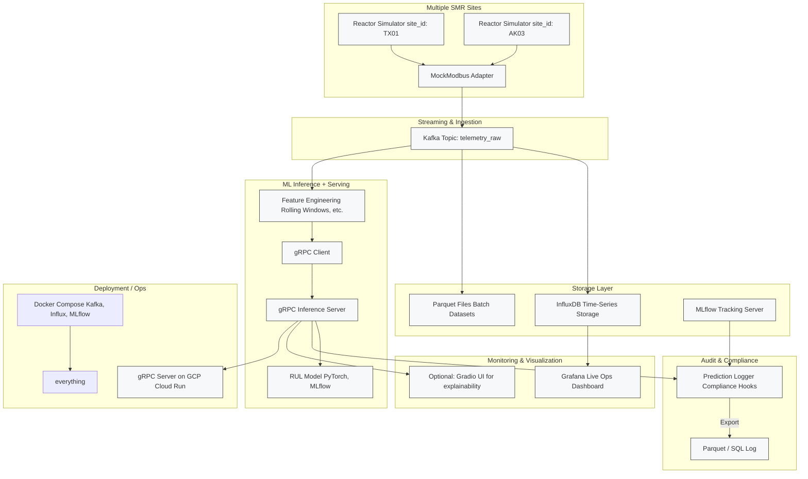

```mermaid
flowchart TD
    subgraph Sites["Multiple SMR Sites"]
        Sim1[Reactor Simulator site_id: TX01]
        Sim2[Reactor Simulator site_id: AK03]
        Modbus1[MockModbus Adapter]
        Sim1 --> Modbus1
        Sim2 --> Modbus1
    end

    subgraph Streaming["Streaming & Ingestion"]
        Kafka[Kafka Topic: telemetry_raw]
        Modbus1 --> Kafka
    end

    subgraph DataStore["Storage Layer"]
        Influx[InfluxDB Time-Series Storage]
        Parquet[Parquet Files Batch Datasets]
        MLflow[MLflow Tracking Server]
        Kafka --> Influx
        Kafka --> Parquet
    end

    subgraph Inference["ML Inference + Serving"]
        FeatureGen[Feature Engineering Rolling Windows, etc.]
        GRPCClient[gRPC Client]
        GRPCServer[gRPC Inference Server]
        RULModel[RUL Model PyTorch, MLflow]
        Kafka --> FeatureGen
        FeatureGen --> GRPCClient
        GRPCClient --> GRPCServer
        GRPCServer --> RULModel
    end

    subgraph Audit["Audit & Compliance"]
        AuditLog[Prediction Logger Compliance Hooks]
        GRPCServer --> AuditLog
        MLflow --> AuditLog
        AuditLog -->|Export| AuditFile[Parquet / SQL Log]
    end

    subgraph UI["Monitoring & Visualization"]
        Grafana[Grafana Live Ops Dashboard]
        Gradio[Optional: Gradio UI for explainability]
        Influx --> Grafana
        GRPCServer --> Gradio
    end

    subgraph Infra["Deployment / Ops"]
        Docker[Docker Compose Kafka, Influx, MLflow]
        CloudRun[gRPC Server on GCP Cloud Run]
        GRPCServer --> CloudRun
        Docker --> everything
    end

    classDef core fill:#f6f8fa,stroke:#333,stroke-width:1px;
    class Sim1,Sim2,Modbus1,Kafka,Influx,Parquet,FeatureGen,GRPCClient,GRPCServer,RULModel,Grafana,Gradio,MLflow,AuditLog,AuditFile,CloudRun core;
```